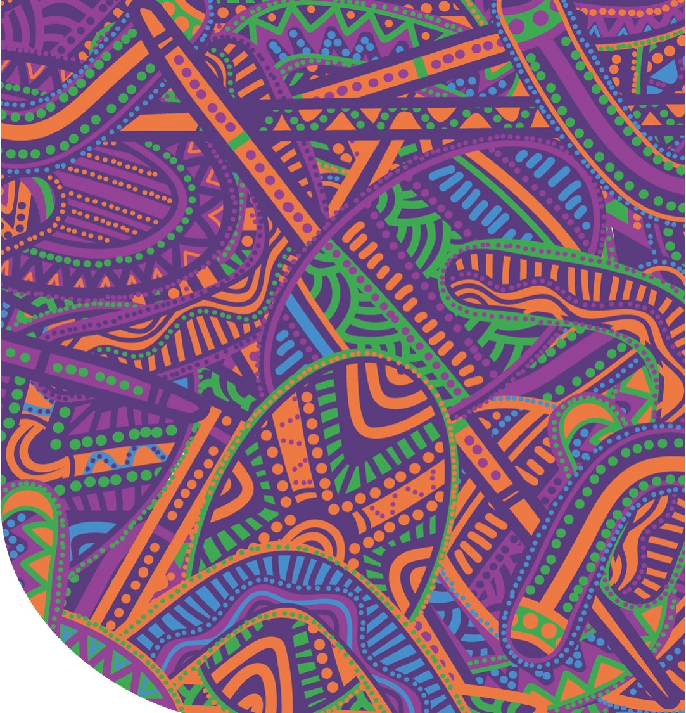
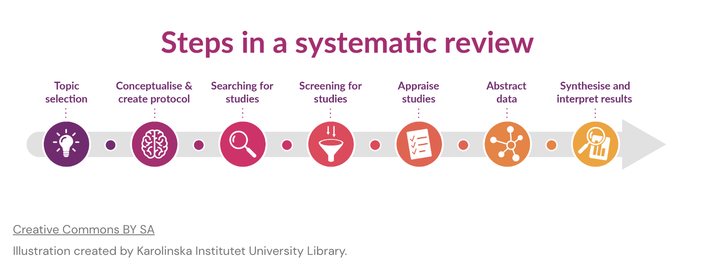
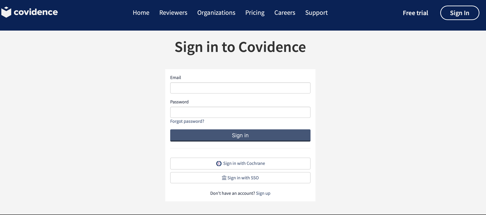
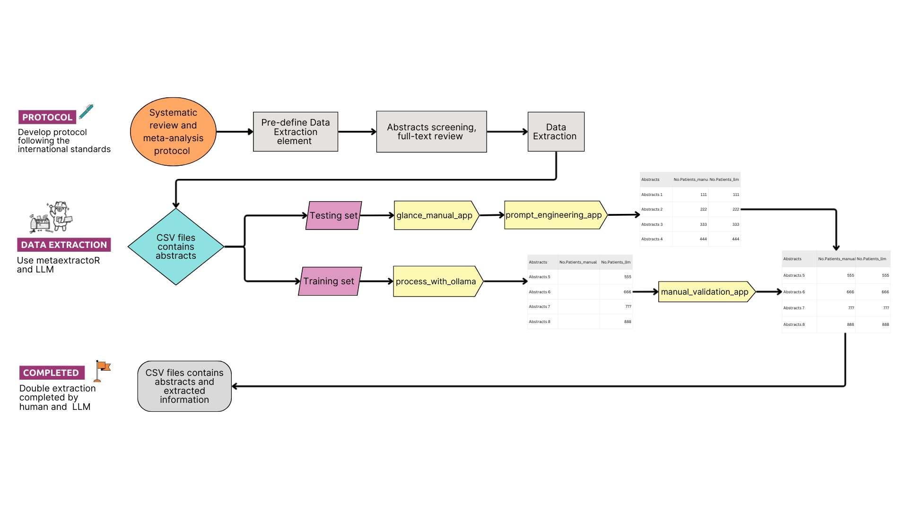
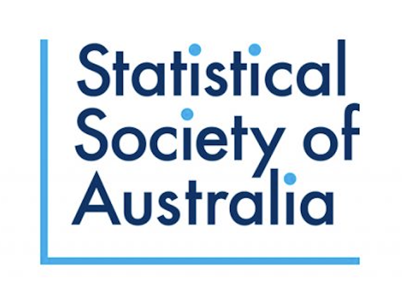

##  {#title-slide background="images/bg_titlepage.png" background-size="100%"}

```{r setup, include = FALSE}
#library(tidyverse)
#library(emo)

rotating_text <- function(x, align = "center") {
  glue::glue('
<div style="overflow: hidden; height: 1.2em;">
<ul class="content__container__list {align}" style="text-align: {align}">
<li class="content__container__list__item">{x[1]}</li>
<li class="content__container__list__item">{x[2]}</li>
<li class="content__container__list__item">{x[3]}</li>
<li class="content__container__list__item">{x[4]}</li>
</ul>
</div>')
}

fa_list <- function(x, incremental = FALSE) {
  icons <- names(x)
  fragment <- ifelse(incremental, "fragment", "")
  items <- glue::glue('<li class="{fragment}"><span class="fa-li"><i class="{icons}"></i></span> {x}</li>')
  paste('<ul class="fa-ul">', 
        paste(items, collapse = "\n"),
        "</ul>", sep = "\n")
}


detach_package <- function(pkg, character.only = FALSE)
{
  if(!character.only)
  {
    pkg <- deparse(substitute(pkg))
  }
  search_item <- paste("package", pkg, sep = ":")
  while(search_item %in% search())
  {
    detach(search_item, unload = TRUE, character.only = TRUE)
  }
}
```

::: title-box
<h2>`r rmarkdown::metadata$pagetitle`</h2>

👩🏻‍💻 [`r rmarkdown::metadata$author` \@ `r rmarkdown::metadata$institute`]{.author}

`r rotating_text(c("<i class='fas fa-envelope'></i> danyang.dai@uq.edu.au", "<i class='fas fa-globe'></i> https://dai.netlify.app/","<i class='fa-brands fa-github'></i> @DanyangDai","<i class='fab fa-linkedin-in'></i> @danyang-dai-7529b4152"))`
:::

<br><br><br><br><br><br><br><br><br><br><br><br><br><br><br><br><br><br><br>

::: {.absolute .top-0 .rladies-purple .w-100 .font-small}
[`r rmarkdown::metadata$date`]{.rladies-purple} [`r rmarkdown::metadata$host`]{.rladies-purple}
:::

::: notes
Hello everybody. Thank you for coming today.I am Daidai and I am a third year PhD student from the University of Queensland. I’m in the final stages of my PhD, graduating mid-next year, and I’m starting to look ahead to my next chapter.

Today, I will be showcasing my very first R package that utilise Large Language Models to extract data for systematic review and meta-analysis.
:::

## [Acknowledgement of Country]{auto-animate="true"}

::::: columns
::: {.column width="50%"}
<br><br>

<p style="text-align: center;">

I acknowledge the Traditional Owners and their custodianship of the lands on which we meet.\
We pay our respects to their Ancestors and their descendants, who continue cultural and spiritual connections to Country.

</p>
:::

::: {.column width="50%"}
{fig-align="center"}
:::
:::::

::: notes
Before I start my presentation, I would like to acknowledge the Traditional Owners and their custodianship of the lands on which we meet. We pay our respects to their Ancestors and their descendants, who continue cultural and spiritual connections to Country.
:::

## [What is Systematic Review?]{auto-animate="true"}

-   A structured, comprehensive method for identifying and summarising all available evidence on a specific research question.

-   Systematic reviews and meta-analyses are pillars of evidence-based medicine.

-   {fig-align="center"}

::: notes
Systematic review and meta-analysis might not be a familiar term for many of you. They are widely regarded as the "gold standard" for generating high-quality evidence to inform clinical practice and policy decisions.

The steps includes topic selection, conceptualised and create protocol, searching for studies,screening for studies,appraise studies, data extraction, synthesis and interpret results.

This might still be quite abstract to you, so let me show you an example.
:::

## [Example of a sysrematic review and meta-analysis]{auto-animate="true"}

<iframe src="https://jogh.org/2025/jogh-15-04166" width="1200" height="600" style="border:none;">

</iframe>

::: notes
In this systematic review and meta-analysis, we set out to understand the true prevalence of COVID-associated acute kidney injury. Yes—you heard that right. Acute kidney injury, or AKI, is actually one of the more common complications seen in hospitalised COVID patients. It refers to a sudden loss of kidney function, typically detected through changes in serum creatinine.

What sparked this project was a simple question: why do published AKI prevalence vary so dramatically? When I looked into the literature, I found reported prevalence ranging anywhere from 1% to 70%. So, we undertook this systematic review and meta-analysis to bring clarity to the global picture—examining where and why COVID-associated AKI rates differ, and uncovering geographic and socioeconomic patterns that may explain these disparities.

In this systematic review and meta-analysis, we observed a clear pattern: COVID-associated AKI higher in high-income countries, and substantially lower in low- and lower-middle-income countries. For more information, please see the paper.

To arrive at this finding, we extracted data from over 300 published studies using Covidence. And in case you’re not familiar with Covidence, let me show you a quick example of how it works. The most important information we need was the number of patients included in each study, the number of AKI patients, clincial settings on wheather this is an ICU only cohort or not.
:::

## [Data extraction - Covidence]{auto-animate="true"}

[{fig-align="center"}](https://app.covidence.org/sign_in)

::: notes
This is a very manual process as you can see, it requires a lot of human effort.

For a more robust process, dual extraction is required sometime. This means that this process will be done twice by two individuals.
:::

## [Design of metaextractoR]{auto-animate="true"}

{fig-align="center" width="1400" height="600"}

::: notes
Because data extraction can be incredibly labour-intensive, we wanted a way to streamline the process. So we built an R package called metaextractoR, which uses large language models to help automate parts of data extraction and reduce the manual workload.

The workflow is designed around the Cochrane systematic review guidelines, and importantly, it keeps humans in the loop at every step to make sure the output stays accurate and reliable.

We’ve also created three Shiny apps that give users an easy, intuitive interface, so anyone can extract data with the help of LLMs—without much coding background.

The first step is load in the list of abstracts included for your systematic reivew and meta-analysis.

We will use the buidin function in this package to separate the list of abstracts into training and testing set.

The training set will be used in the first and second apps for prompt engineering and model selection, the testing set will be use for bath processing and validation.
:::

## [Demo]{auto-animate="true"}

{fig-align="center"}

## [Accurate Evaluation]{auto-animate="true"}

| Model     | No. Patients | No. AKI | ICU Only | Mean Age | Median Age | Start Date | End Date |
|---------|---------|---------|---------|---------|---------|---------|---------|
| llama     | 0.85         | 0.86    | 0.79     | 0.73     | 0.45       | 0.44       | 0.47     |
| gemma     | 0.68         | 0.53    | 0.89     | 0.73     | 0.64       | 0.40       | 0.49     |
| medllama  | 0.66         | 0.51    | 0.32     | 0.73     | NA         | 0.51       | 0.49     |
| mistral   | 0.76         | 0.49    | 0.53     | 0.73     | 0.64       | 0.42       | 0.51     |
| nuextract | 0.85         | 0.30    | 0.47     | 0.64     | 0.45       | 0.28       | 0.35     |
| deepseek  | 0.42         | 0.51    | 0.37     | 0.73     | 0.55       | 0.51       | 0.53     |

: For all LLMs, the model temperature was set to 0.

## [Total Accuracy of the LLMs and Run Time]{auto-animate="true"}
::: {style="text-align:center;"}
| Model       | Accuracy | Run time   |
|-------------|----------|------------|
| llama3.1    | 0.693    | 9.21 mins  |
| gemma3      | 0.594    | 9.02 mins  |
| medllama2   | 0.533    | 9.61 mins  |
| mistral     | 0.594    | 11.55 mins |
| nuextract   | 0.529    | 6.91 mins  |
| deepseek-r1 | 0.483    | 11.48 mins |
:::
## [Furture work]{auto-animate="true"}

-   Expand the extraction to text for qualitative analysis

-   Allow full-text data extraction

-   Allow other closed-sourced LLMs

## [Acknowledgement]{auto-animate="true"}

<br>

<p style="text-align: center;">

Dr. Emi Tanaka [emi.tanaka\@anu.edu.au](emi.tanaka@anu.edu.au)

</p>

<br>

<p style="text-align: center;">

Prof. Jason Pole [j.pole\@uq.edu.au](j.pole@uq.edu.au)

</p>

<br>

::: {layout="[50,50]"}
{fig-align="center" width="300" height="300"}

{fig-align="center" width="300" height="300"}
:::

## [Github and Installation]{auto-animate="true"}

`r fa_list(c("fa-solid fa-globe" = "https://danyangdai.github.io/metaextractoR/","fa-solid fa-code-branch" = "Collaborate at: https://github.com/DanyangDai/metaextractoR"))`

::::::::: columns
::::: column
::: {style="text-align:center;"}
{width="300"}
:::

::: {style="text-align:center;"}
<i class="fa-brands fa-github fa-2x"></i>
:::
:::::

::::: column
::: {style="text-align:center;"}
{width="300"}
:::

::: {style="text-align:center;"}
<i class="fa-brands fa-youtube fa-2x"></i>
:::
:::::
:::::::::

## [Stay in touch]{auto-animate="true"}

::: {style="text-align:center;"}

:::

[danyan.dai01\@gmail.com](mailto:danyan.dai01@gmail.com)

<https://www.linkedin.com/in/danyang-dai-7529b4152/>
